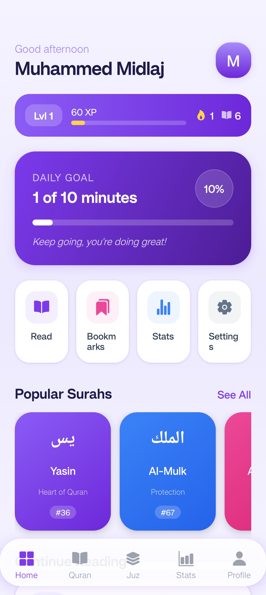
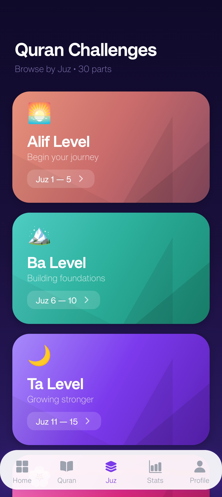
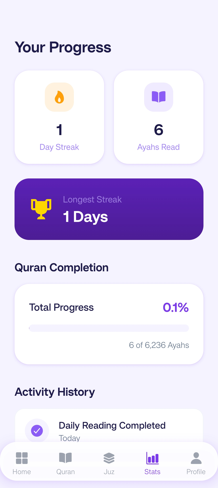
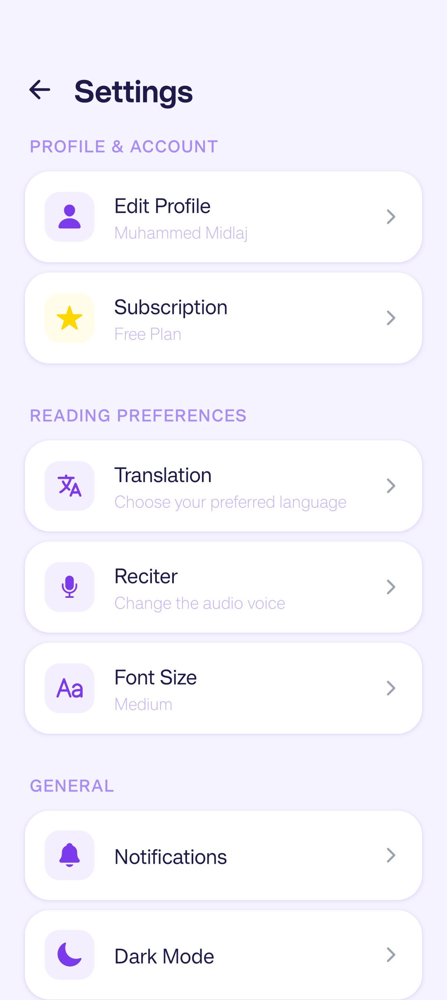

# Tilaawah Daily


A mobile application for daily Quran recitation and spiritual reminders built with React Native and Expo.

## 📱 About

Tilaawah Daily is a comprehensive mobile app designed to help users maintain consistent Quran recitation habits with daily reminders, progress tracking, and spiritual guidance.

## 📸 Screenshots

### Home Screen


*Main dashboard showing daily verse and progress*

### Daily Verse


*Daily Quran verse with translation and audio*

### Progress Tracking


*Visual progress charts and achievement badges*

### Settings


*App preferences and notification settings*

## ✨ Features

- **Daily Quran Verses**: Receive curated verses for daily recitation
- **Progress Tracking**: Monitor your recitation consistency and goals
- **Push Notifications**: Timely reminders for your daily tilaawah
- **Audio Support**: Listen to recitations from renowned Qaris
- **Google Authentication**: Secure sign-in with Google account
- **Responsive Design**: Optimized for both iOS and Android devices

## 🛠 Tech Stack


### Core Technologies

- **Framework**: React Native with Expo
- **Navigation**: Expo Router
- **State Management**: Zustand
- **Authentication**: Google Sign-In
- **Backend**: Firebase
- **Storage**: AsyncStorage
- **UI Components**: Expo Vector Icons
- **Animations**: React Native Reanimated

## 🚀 Getting Started

### Prerequisites

- Node.js (v18 or higher)
- npm or yarn
- Expo Go app (for development)
- Google Developer Console account (for authentication)

### Installation

1. Clone the repository:
```bash
git clone https://github.com/yourusername/tilaawah-daily.git
cd tilaawah-daily
```

2. Install dependencies:
```bash
npm install
```

3. Set up environment variables:
```bash
cp .env.example .env
# Add your Firebase and Google credentials to .env
```

4. Start the development server:
```bash
npm start
```

5. Scan the QR code with Expo Go app on your device

## 🔧 Configuration

### Google Authentication Setup

1. Go to [Google Cloud Console](https://console.cloud.google.com/)
2. Create a new project or select existing one
3. Enable Google Sign-In API
4. Create OAuth 2.0 credentials
5. Add your client ID to the app configuration

### Firebase Setup

1. Create a new Firebase project
2. Enable Authentication (Google Sign-In)
3. Configure Firestore for data storage
4. Download configuration files
5. Place `google-services.json` (Android) and `GoogleService-Info.plist` (iOS) in the project root

## 📁 Project Structure

```
tilaawah-daily/
├── app/                 # App screens and navigation
├── components/          # Reusable UI components
├── constants/           # App constants and configurations
├── hooks/               # Custom React hooks
├── services/            # API and business logic services
├── store/               # State management stores
├── types/               # TypeScript type definitions
├── assets/              # Static assets (images, fonts)
├── screenshots/         # App screenshots for README
└── utils/               # Utility functions
```

## 📸 Adding Screenshots

To add screenshots to the README:

1. Create a `screenshots/` directory in the project root
2. Add your screenshot files (PNG/JPG format recommended)
3. Update the image paths in the README.md file
4. For best results, use screenshots with these dimensions:
   - Mobile: 375x812px (iPhone X/11/12 dimensions)
   - Tablet: 768x1024px (iPad dimensions)

### Screenshot Guidelines:
- Use high-quality images (minimum 72 DPI)
- Include both light and dark mode if supported
- Show key features and user flows
- Avoid sensitive user data in screenshots
- Optimize images for web (compress to < 200KB per image)
- Use consistent width (300px recommended for mobile screenshots)

## 🎯 Scripts

- `npm start` - Start Expo development server
- `npm run android` - Run on Android device/emulator
- `npm run ios` - Run on iOS device/simulator
- `npm run web` - Run in web browser

## 🤝 Contributing

We welcome contributions! Please read our [Contributing Guidelines](CONTRIBUTING.md) for details on our code of conduct and the process for submitting pull requests.

## 📄 License

This project is licensed under the MIT License - see the [LICENSE](LICENSE) file for details.

## 🙏 Acknowledgments

- Quran.com API for verse data
- Expo team for the amazing framework
- React Native community for valuable packages

## 📞 Support

For support, please open an issue on GitHub or contact us at support@tilaawah-daily.com.

---

**Made with ❤️ for the Muslim Ummah**
# Tilaawah-Daily
